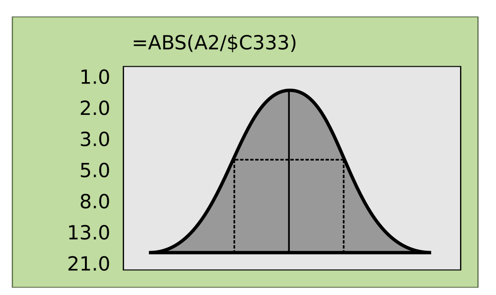

Data Analytics
==============

*von Dr. Kristian Rother*

Hier findest Du das Begleitmaterial zu meinem Kurs "Data Analytics".

Themenübersicht
---------------

Der Kurs deckt folgende Themenbereiche ab:

* Tabellenkalkulationen
* SQL-Datenbanken
* Daten säubern, aufräumen und normalisieren
* Univariate und bivariate Statistik
* Verteilungen
* maschinelle Lernverfahren (Regression, Clustering usw.)
* neuronale Netze

Solte etwas nicht stimmen oder wenn du eine Frage hast, schreibe mir gerne eine e-Mail (`kristian.rother@posteo.de`).

Tabellenkalkulation
-------------------

.. toctree::
   :maxdepth: 1

   tabellenkalkulation/erste_schritte.rst
   tabellenkalkulation/daten_laden.rst
   tabellenkalkulation/anteil_vornamen.rst
   tabellenkalkulation/anfangsbuchstaben.rst
   tabellenkalkulation/letzte_buchstaben_revolution.rst
   tabellenkalkulation/histogramm.rst

   

Anhang
------

.. toctree::
   :maxdepth: 1

   links.rst

   
Lizenz
------

© 2024 Kristian Rother (krother@academis.eu)

Veröffentlicht unter den Bedingungen der Creative Commons Namensnennungs-Lizenz (CC-BY-4.0).
Einzelheiten auf `creativecommons.org <https://creativecommons.org/licenses/by-sa/4.0/>`__ .

Besonderer Dank gilt Wes McKinney, durch dessen Buch *"Python for Data Analysis"* ich auf den faszinierenden Datensatz der Babynamen gestoßen bin.

.. hint:: 
   
   **Hinweis für Trainer und Dozenten**

   Du darfst dieses e-Book oder Teile davon gerne kopieren, modifizieren
   und ergänzen. Bitte achte darauf, daß die Lizenzvereinbarung und ein
   Hinweis auf den Autor erhalten bleibt. Trage Dich einfach als Autor
   dazu.
