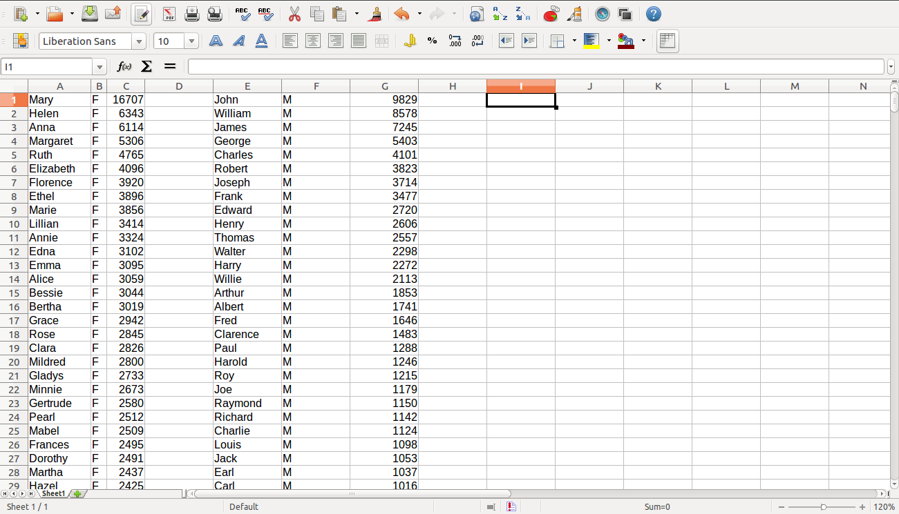
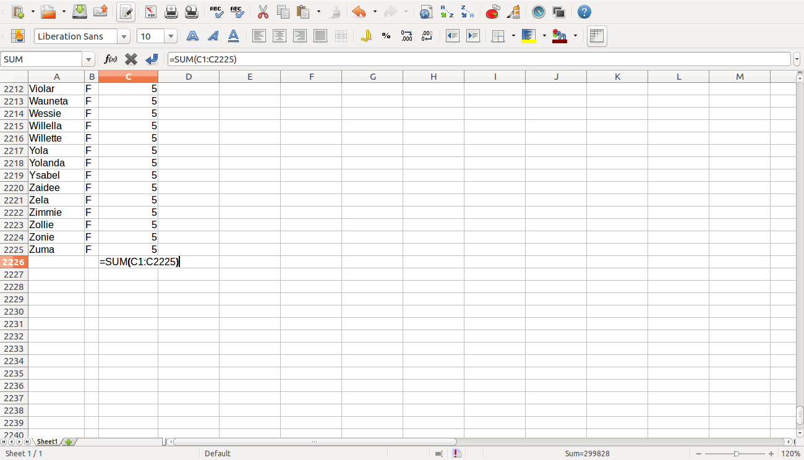

Anteile berechnen
=================

Ziele
-----

-  ein großes Tabellendokument navigieren
-  Bereiche auswählen und verschieben
-  eine Summe berechnen
-  einen prozentualen Anteil berechnen

Aufgaben
--------

Wir möchten wissen, ob die in den USA verwendeten Namen in den letzten
100 Jahren mehr oder weniger abwechslungsreich geworden sind. Dazu
berechnen wir, welchen Anteil die 10 häufigsten Babynamen an den
Geburten in den Jahren 1900 und 2000 haben.

.. topic:: Check

   *Du solltest an dieser Stelle eine Datei mit Babynamen in Deine
   Tabellenkalkulation geladen haben. Die Tabelle sollte drei Spalten haben
   (*\ Name, Geschlecht, Anzahl*).
   
1. Navigieren der Tabelle
~~~~~~~~~~~~~~~~~~~~~~~~~

Fahre in der Tabelle zum Ende. Wähle dazu eine belegte Zelle aus und
drücke **Strg + Pfeil-unten**. Fahre mit **Strg + Pfeil-oben** wieder
hoch.

Finde nun die Stelle, an der die Mädchennamen (F) aufhören und die
Jungennamen beginnen.

Dazu fahre in der Tabelle ganz nach oben. Suche mit **Strg + F** einen
Jungennamen, von dem Du glaubst, daß er ganz weit oben in der Liste
steht.

**In welcher Zeile steht der letzte Mädchenname?**

2. Bereiche auswählen und verschieben
~~~~~~~~~~~~~~~~~~~~~~~~~~~~~~~~~~~~~

Wir möchten die Mädchen- und Jungennamen zum besseren Vergleich
nebeneinander stellen. Markiere dazu den gesamten Bereich mit
Jungennamen, schneide ihn aus und füge ihn als Spalte E-G wieder ein.
Im Einzelnen:

* Wähle die erste Zelle mit einem Jungennamen an. Verwende dann **Umschalten + Pfeile** um einen Bereich zu markieren. 
* Mit **Umschalten + Bild auf/ab** und **Umschalten + Strg + Pfeil** kannst Du schnell sehr große Bereiche markieren.
* Schneide alle drei Spalten zu Jungennamen mit **Strg + x** aus.
* Fahre ganz nach oben und wähle die Zelle **E1** an. Drücke **Strg + v**, um die Daten dort einzufügen.

**Gibt es mehr unterschiedliche Jungen- oder Mädchennamen?**

3. Gesamte Geburten von Mädchen und Jungen berechnen
~~~~~~~~~~~~~~~~~~~~~~~~~~~~~~~~~~~~~~~~~~~~~~~~~~~~

Fahre in **Spalte C** ganz nach unten. Gehe in die erste leere Zeile und
schreibe dort:

::

   =SUMME(C1:C333)

oder in einem englischsprachigen System:

::

   =SUM(C1:C333)

Drücke die Eingabetaste. Wenn Du ein *####* siehst, verbreitere die
Spalte im Tabellenkopf durch Ziehen mit der Maus (alternativ:
*Rechtsklick auf C -> Optimale Spaltenbreite*).

Setze nun für *333* die Nummer der letzten Zeile mit Daten ein.

**Wie viele Mädchen und Jungen wurden im jeweiligen Jahr geboren?**

4. Prozentualen Anteil berechnen
~~~~~~~~~~~~~~~~~~~~~~~~~~~~~~~~

Wir möchten nun in Spalte berechnen, welchen Prozentanteil die
beliebtesten Namen an den Geburten einnehmen. Notiere Dir dazu die Zeile
mit der soeben berechneten Summe (*auf Papier*).

Fahre wieder nach oben. Trage in Zelle D1 ein:

::

   =C1/C$333

Ersetze die *333* durch die notierte Zeile mit der Summe. Verbreitere
wieder die Spalte falls nötig. Oben in der Symbolleiste solltest Du
einen Knopf **%** finden. Diesen bitte drücken. In der Nähe sind zwei
weitere Knöpfe, mit denen Du mehr oder weniger Nachkommastellen anzeigen
kannst. Finde eine Einstellung, die Du übersichtlich findest.

Welcher Prozentanteil fällt auf den häufigsten Namen?

5. Prozentualer Anteil für eine ganze Spalte
~~~~~~~~~~~~~~~~~~~~~~~~~~~~~~~~~~~~~~~~~~~~

Markiere die Zelle D1 mit der Prozentformel. Kopiere diese über
**Editieren -> Kopieren** oder **Strg + c**.

Markiere nun die gesamte Spalte D bis zum letzten Namen (z.B. nach unten
fahren und dann mit **Umschalten + Strg + Pfeil hoch** markieren). Füge
nun mit **Editiren -> Einfügen** oder **Strg + v** ein.

.. hint::

   Wenn Du das Gefühl hast, daß etwas gewaltig schief gegangen ist,
   probiere die Änderung mit \**Strg + z\* rückgängig zu machen.

Fragen
^^^^^^

-  Inspizire die Formel in den Zellen D2, D3 usw. Was genau ist beim
   Kopieren passiert?
-  Was macht das Dollarzeichen ($)?
-  Wie könntest Du prüfen, ob die Prozentberechnung korrekt ist, also
   insgesamt 100% ergibt?

6. Vergleich zwischen Jungen und Mädchen?
~~~~~~~~~~~~~~~~~~~~~~~~~~~~~~~~~~~~~~~~~

Wiederhole die Schritte 3 bis 5 für die Jungennamen in den Spalten E-G.

Gibt es einen Unterschied zwischen Mädchen und Jungen?

7. Vergleich zwischen zwei Jahrgängen
~~~~~~~~~~~~~~~~~~~~~~~~~~~~~~~~~~~~~

Vergleiche den Prozentanteil der häufigsten Namen im Jahr 1900 und
dem jüngsten Jahrgang.
Sind die Babynamen in dieser Zeit abwechslungsreicher geworden?

8. Anteil der 10 häufigsten Namen
~~~~~~~~~~~~~~~~~~~~~~~~~~~~~~~~~

Berechne die Summe der Prozentanteile für die häufigsten 10 Namen.

9. Anteil an der Gesamtbevölkerung
~~~~~~~~~~~~~~~~~~~~~~~~~~~~~~~~~~

Berechne den prozentualen Anteil an den gesamten Geburten (Mädchen +
Jungen)

10. Diagramm
~~~~~~~~~~~~

Stelle die Prozentanteile der beliebtesten 10 Jungen- und Mädchennamen
als Balkendiagramm dar.

11. Diskussion
~~~~~~~~~~~~~~

Was für Stärken und Schwächen hat diese Beschreibung der Verschiedenheit
von Namen?
