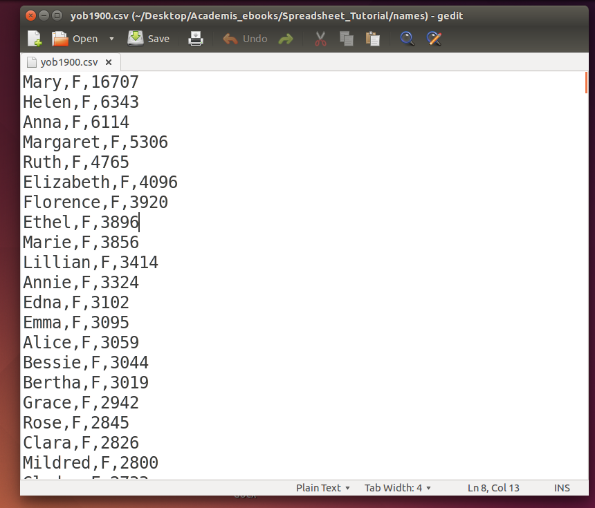
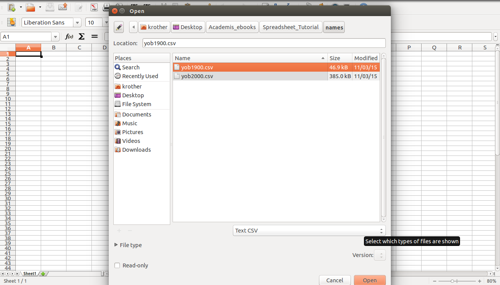
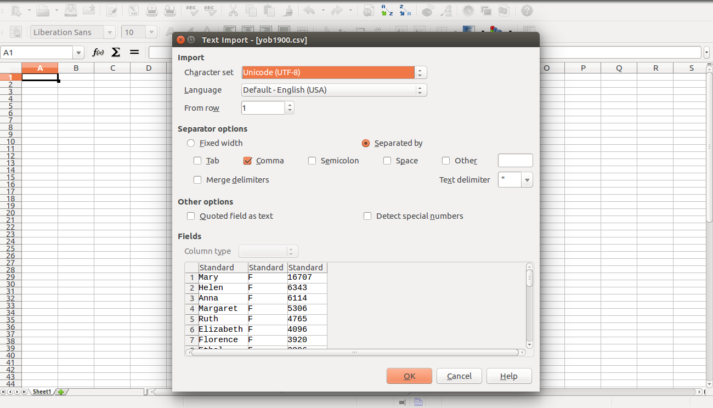

Daten laden
===========

Ziele
-----

-  eine Tabellenkalkulation starten
-  eine Tabelle mit Babynamen laden
-  das Textformat CSV kennen lernen

.. topic:: Die Statistik der US-Babynamen
   
   .. figure:: images/baby.png
      :alt: Babynamen
      
   Die US-Behörden veröffentlichen die Vornamen der seit 1880 als US-Bürger
   geborenen Menschen. Aus Datenschutzgründen sind nur Namen enthalten, die
   mindestens 5 Mal in einem Jahr verwendet wurden. In diesem Kurs werden
   wir diesen Datensatz genauer untersuchen.
   
   Die vollständigen Daten findest du auf
   `http://www.ssa.gov/oact/babynames/limits.html <http://www.ssa.gov/oact/babynames/limits.html>`__ .

Aufgaben
--------

Der Einfachheit halber werden wir für die folgenden Übungen nur einen der
Datensätze betrachten, nämlich as jüngste verfügbare Jahr.

1. Speichere die Dateien mit Babynamen auf Deinem Computer
~~~~~~~~~~~~~~~~~~~~~~~~~~~~~~~~~~~~~~~~~~~~~~~~~~~~~~~~~~

Lade die `Babynamendaten <http://www.ssa.gov/oact/babynames/limits.html>`__ herunter.
Uns interessiert die allgemeine Statistik, nicht die nach Bundesstaaten gegliederte. Du solltest eine ZIP-Datei von 6 MB
Größe erhalten. Entpacke die ZIP-Datei. Es sollte ein neuer Ordner
entstehen.

::

   yob1880.txt  yob1900.txt  yob1920.txt  yob1940.txt  yob1960.txt ...
   yob1881.txt  yob1901.txt  yob1921.txt  yob1941.txt  yob1961.txt ...
   yob1882.txt  yob1902.txt  yob1922.txt  yob1942.txt  yob1962.txt ...
   ...

**Wie viele Dateien befinden sich im Ordner *names*?**

2. Das Datenformat inspizieren
~~~~~~~~~~~~~~~~~~~~~~~~~~~~~~

Die Daten sind in Textdateien gespeichert. Öffne eine der Dateien in
einem beliebigen Texteditor (unter Windows z.B. Notepad oder Wordpad).

Fragen
^^^^^^

-  Was für Daten befinden sich in jeder Zeile?
-  Wie sind die Spalten voneinander abgegrenzt?
-  Mit was für Daten wäre das Format schwierig zu verwenden?

3. Lade eine Textdatei
~~~~~~~~~~~~~~~~~~~~~~

Öffne eine der Dateien in Deiner Tabellenkalkulation. Verwende die
Option *Datei -> Öffnen* und wähle als Dateityp etwas wie (*Textdateien,
Text/CSV* o.ä.) aus.

Es erscheint ein Dialog, bei dem Du die Trennzeichen zwischen den
Spalten überprüfen kannst. Wähle das Komma.

.. hint::

   Wenn Deine Tabellenkalkulation auf Deutsch eingestellt ist, wird das
   Komma **``,``** zum Markieren der Nachkommastellen verwendet, im
   Englischen dagegen der Punkt **``.``**. Wenn Du Daten mit Punkten in ein
   deutsches Programm laden möchtest oder umgekehrt, mußt Du diese
   eventuell vorher im Texteditor oder der Tabellenkalkulation selbst
   **suchen & ersetzen**.

**Wie viele Zeilen hat die Tabelle?**

.. hint:: Umbenennen von Dateien

   Für manche Tabellenkalkulationen ist die Endung des Dateinamens wichtig,
   damit das Format richtig erkannt wird. Um die Dateinamen zu sehen, mußt
   Du unter Windows eventuell unter *Ordneroptionen* die Endungen
   einblenden.
   
   Falls die Dateien mit der Endung **TXT** nicht geladen werden können,
   ändere die Endung von zwei Dateinamen (1900, 2000) von **TXT** nach
   **CSV**.
