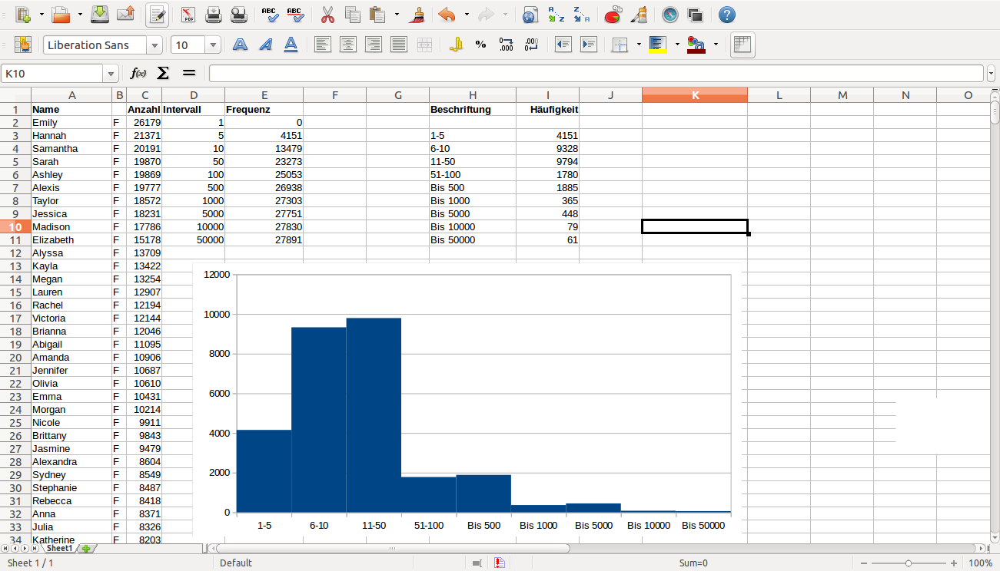

Histogramm der Namenshäufigkeiten
=================================

Ziele
-----

-  ein Histogramm erstellen
-  Werte auszählen

Aufgaben
--------

Wir möchten die Namen in drei Klassen einteilen: **sehr häufige**,
**häufige** und **seltene**. Wir möchten auszählen, wie viele Namen in
jeder Klasse auftreten und diese anschließend grafisch darstellen. Eine
solche grafische Darstellung nennt man ein **Histogramm**.

Check
^^^^^

Du brauchst eine geladene Tabelle wie die aus der ersten Übung. Es
genügen Spalten A-C. Speichere Dir die Tabelle als Sicherheitskopie ab,
dann kannst Du die restlichen Spalten löschen.

1. Festlegen der Klassen
~~~~~~~~~~~~~~~~~~~~~~~~

Trage in die leeren Spalten **D** und **E** untereinander die
Klassengrenzen ein, nach denen wir zählen werden:

=========== =====
Klasse      Wert
=========== =====
\           0
selten      500
häufig      1000
sehr häufig 10000
=========== =====

Die erste Zeile mit der Null werden wir als Untergrenze für die
Berechnung brauchen

3. Klassen auszählen
~~~~~~~~~~~~~~~~~~~~

Wir brauchen nun eine zusätzliche Spalte **E**. Zunächst zählen wir, wie
viele Anzahlen von Vornamen in Spalte C innerhalb der Klassen sind.
Trage in Spalte **F** ein:

OpenOffice, Englisch:
^^^^^^^^^^^^^^^^^^^^^

::

   =FREQUENCY(C$1:C$3333, E1)

MS Excel, Deutsch:
^^^^^^^^^^^^^^^^^^

::

   =ZÄHLENWENN(C$1:C$3333; "<=" & E1)

Kopiere die Formel in der Spalte nach unten.

4. das Histogramm darstellen
~~~~~~~~~~~~~~~~~~~~~~~~~~~~

Stelle die Zahlen in Spalte F als Balkendiagramm dar. Du kannst die
Spalte **D** für die Beschriftungen verwenden, damit das Histogramm
leichter lesbar wird.

Setze den Abstand (*spacing*) zwischen den Balken auf 0%.

Fragen
^^^^^^

-  Welche Schwächen hat die im Bild gezeigte Darstellung?
-  Wie kannst Du diese beheben?
